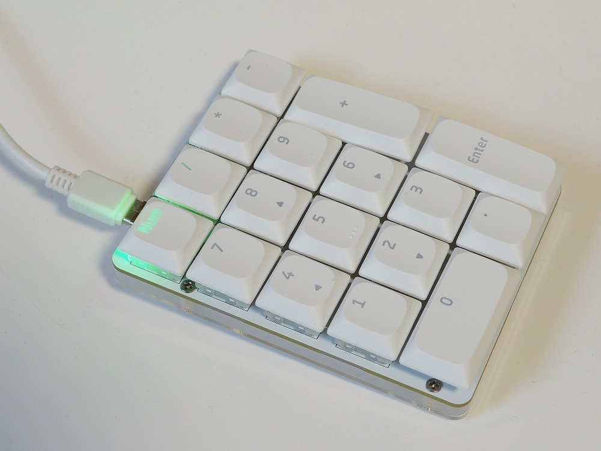
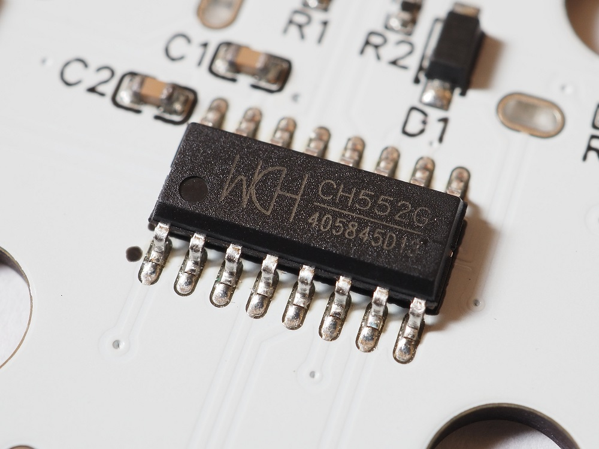
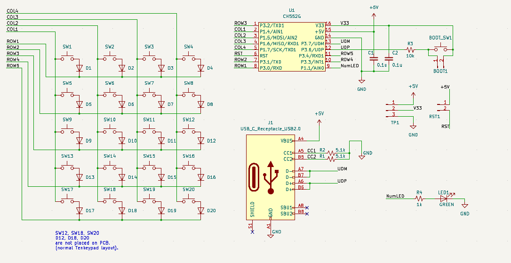
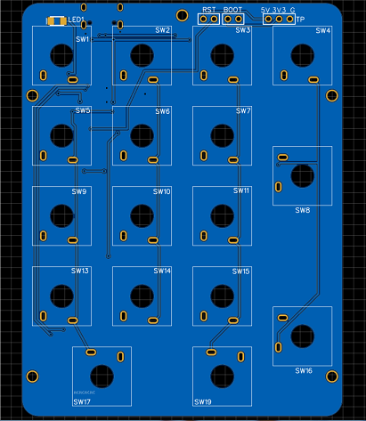
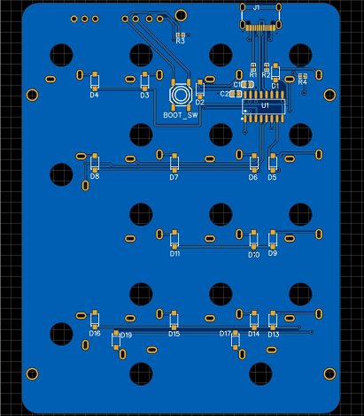
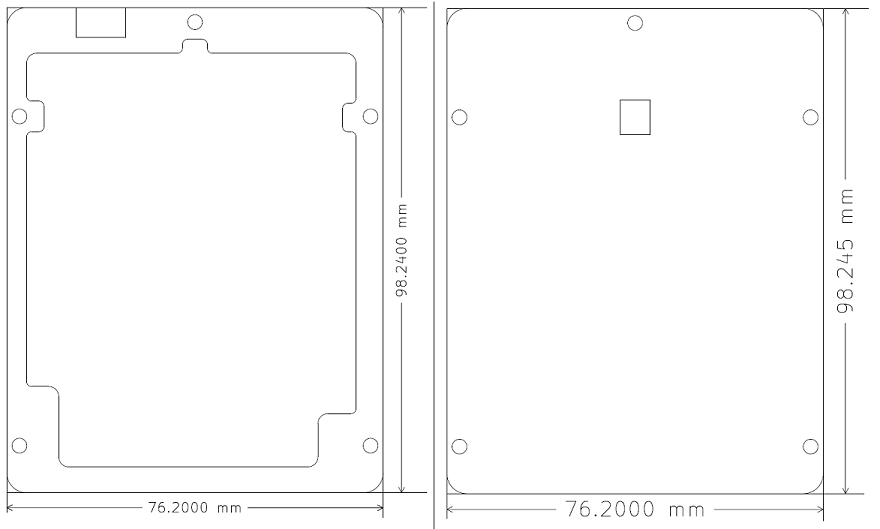

# Just another Numeric Key Pad using ch552G

## Software
Arduino IDE (1.8.19) with [CH55xDuino](https://github.com/DeqingSun/ch55xduino) are required. After installing CH55xDuino, I use VSCode with arduino-cli, it's good.

### numkeyPad_test
numkeyPad_test.ino is my first ch55xduino sketch. It scans keys periodicaly and detect state-changed key. 
If found, it send HID Usage ID of the key and new-state to USBSerial as Hex format.
To build this sketch, USB Settings option in tool menu should be "Default CDC".

### ch552_numkeyPad
ch552_numkeyPad.ino is HID version of numkeyPad program. It is based on CH55xDuino example sketch USBHIDKeyboard.c. 
It detects key events in the same way as the sketch above and send them as HID input reports.
To build this sketch, USB Settings option in tool menu should be "USR CODE w/ 148B USB ram". 
This option seems to mean allocating USB EP buffers for use with HID instead of CDC, 
but 148Bytes of External RAM (xram) are also reserved in "Default CDC" option. 
With a little more research, I'd be able to understand the memory management too.

WITH_MODIFIERS macro in USBconstant.h modifies HID INPUT Report Descriptor structure. 
if WITH_MODIFIERS is not defined, modifier releated items in Input report are elimenated and Input Report array size is reduced.

## Hardware
ch552_numkeyPad is simple and small USB keypad using CH552G. it is utilized USB-device functionality of CH552G.

The key layout is the same as numeric keypad area of standard full keyboard.

### Schematics and PCB

Editable schematics and PCB are here, 
see [https://oshwlab.com/takeshihigasa/ch552_tenkeypad_copy](https://oshwlab.com/takeshihigasa/ch552_tenkeypad_copy)

A PDF version of the schematic and PCBs photo views are also available in the pcb directory.

  

### acrylic plate

Outline drawing of  laser cutting for an acrylic plates. The left side is the middle plate and the right side is the bottom plate. The PDF and DXF files used for ordering are in the pcb directory.

## License

The library is dual licensed under [MIT](LICENSE) and [CC-BY-SA 4.0](pcb/LICENSE-CC-BY-SA).

